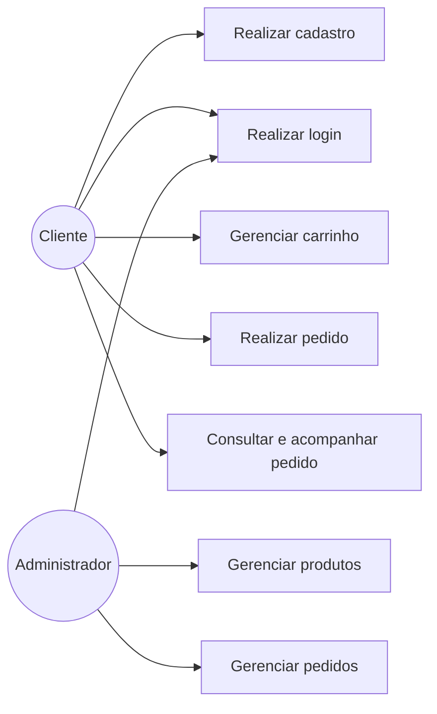
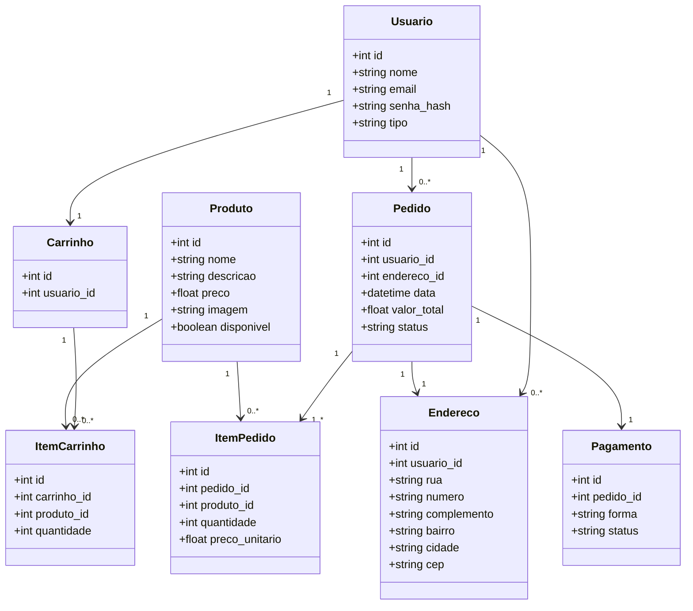

# Documentação Revisada

## Cupcake Shop

### 1. Visão do projeto

A Cupcake Shop é uma aplicação web desenvolvida para apoiar a venda de cupcakes pela internet.

A solução permite que o cliente visualize os produtos disponíveis, realize seu cadastro, faça login, adicione produtos ao carrinho, informe o endereço de entrega, escolha uma forma de pagamento e acompanhe o andamento do pedido.

Também foi desenvolvida uma área administrativa para gerenciamento dos produtos e atualização do status dos pedidos.

---

## 2. Objetivo

Desenvolver uma aplicação web simples e responsiva que digitalize o processo de venda de cupcakes, contemplando as etapas de vitrine, pedido eletrônico, pagamento demonstrativo e acompanhamento da entrega.

---

## 3. Escopo da solução

### Cliente

O cliente pode:

- visualizar os cupcakes disponíveis;
- criar uma conta;
- realizar login;
- adicionar produtos ao carrinho;
- aumentar ou diminuir quantidades;
- remover produtos;
- visualizar o valor total;
- informar o endereço de entrega;
- escolher a forma de pagamento;
- confirmar o pedido;
- consultar seus pedidos;
- acompanhar o status do pedido.

### Administrador

O administrador pode:

- acessar uma área administrativa;
- cadastrar novos cupcakes;
- editar produtos existentes;
- alterar preço e descrição;
- definir a disponibilidade dos produtos;
- consultar os pedidos realizados;
- atualizar o status dos pedidos.

---

# 4. Histórias de Usuário

## US01 — Visualizar produtos

**Solicitante:** Cliente  
**Ação:** Visualizar os cupcakes disponíveis na vitrine virtual.  
**Critério de aceitação:** A aplicação deve apresentar nome, descrição, preço e representação visual do produto.  
**Prioridade:** A  
**Story Points:** 3

---

## US02 — Visualizar informações do produto

**Solicitante:** Cliente  
**Ação:** Consultar as informações necessárias para escolher um cupcake.  
**Critério de aceitação:** Nome, descrição, preço e disponibilidade devem estar visíveis na vitrine.  
**Prioridade:** B  
**Story Points:** 2

---

## US03 — Criar conta

**Solicitante:** Cliente  
**Ação:** Realizar cadastro no sistema.  
**Critério de aceitação:** O sistema deve permitir cadastro com nome, e-mail e senha e impedir a duplicidade de e-mail.  
**Prioridade:** A  
**Story Points:** 3

---

## US04 — Realizar login

**Solicitante:** Cliente  
**Ação:** Entrar na aplicação utilizando e-mail e senha.  
**Critério de aceitação:** Somente usuários com credenciais válidas devem acessar sua conta.  
**Prioridade:** A  
**Story Points:** 3

---

## US05 — Adicionar produto ao carrinho

**Solicitante:** Cliente  
**Ação:** Adicionar um cupcake ao carrinho.  
**Critério de aceitação:** O produto selecionado deve ser registrado no carrinho do usuário.  
**Prioridade:** A  
**Story Points:** 3

---

## US06 — Visualizar carrinho

**Solicitante:** Cliente  
**Ação:** Consultar os produtos selecionados.  
**Critério de aceitação:** O carrinho deve apresentar produtos, quantidades, subtotais e total do pedido.  
**Prioridade:** A  
**Story Points:** 3

---

## US07 — Alterar quantidade

**Solicitante:** Cliente  
**Ação:** Aumentar ou diminuir a quantidade de um produto.  
**Critério de aceitação:** O sistema deve recalcular os valores após a alteração.  
**Prioridade:** B  
**Story Points:** 2

---

## US08 — Remover produto

**Solicitante:** Cliente  
**Ação:** Remover um produto do carrinho.  
**Critério de aceitação:** O item deve ser excluído e o total recalculado.  
**Prioridade:** B  
**Story Points:** 2

---

## US09 — Informar endereço

**Solicitante:** Cliente  
**Ação:** Informar o endereço para entrega.  
**Critério de aceitação:** Os dados obrigatórios do endereço devem ser preenchidos antes da confirmação do pedido.  
**Prioridade:** A  
**Story Points:** 3

---

## US10 — Escolher pagamento

**Solicitante:** Cliente  
**Ação:** Selecionar a forma de pagamento.  
**Critério de aceitação:** O sistema deve disponibilizar Pix, cartão de crédito e cartão de débito.

**Regra de negócio:** O pagamento é demonstrativo para fins acadêmicos e não realiza transação financeira real.  
**Prioridade:** A  
**Story Points:** 3

---

## US11 — Confirmar pedido

**Solicitante:** Cliente  
**Ação:** Revisar e confirmar a compra.  
**Critério de aceitação:** O sistema deve registrar produtos, endereço, valor e forma de pagamento.  
**Prioridade:** A  
**Story Points:** 3

---

## US12 — Receber número do pedido

**Solicitante:** Cliente  
**Ação:** Receber a confirmação da realização do pedido.  
**Critério de aceitação:** Após a confirmação, o sistema deve gerar um identificador para o pedido.  
**Prioridade:** A  
**Story Points:** 2

---

## US13 — Consultar e acompanhar pedidos

**Solicitante:** Cliente  
**Ação:** Consultar os pedidos realizados e seu andamento.  
**Critério de aceitação:** O sistema deve apresentar o pedido e seu status atual.

**Status previstos:**

1. Recebido
2. Em preparo
3. Saiu para entrega
4. Entregue

Quando o pedido estiver como "Saiu para entrega", a aplicação apresenta uma representação visual demonstrativa da rota.

**Prioridade:** B  
**Story Points:** 3

---

## US14 — Gerenciar produtos

**Solicitante:** Administrador  
**Ação:** Cadastrar e editar cupcakes.  
**Critério de aceitação:** O administrador deve conseguir alterar nome, descrição, preço, imagem e disponibilidade.  
**Prioridade:** B  
**Story Points:** 5

---

## US15 — Gerenciar pedidos

**Solicitante:** Administrador  
**Ação:** Consultar pedidos e atualizar seus status.  
**Critério de aceitação:** A alteração realizada pelo administrador deve ficar registrada e ser apresentada posteriormente ao cliente.  
**Prioridade:** B  
**Story Points:** 5

---

# 5. Casos de Uso

Os principais casos de uso identificados são:

**UC01 — Realizar cadastro**  
Ator: Cliente

**UC02 — Realizar login**  
Ator: Cliente

**UC03 — Gerenciar carrinho**  
Ator: Cliente

**UC04 — Realizar pedido**  
Ator: Cliente

**UC05 — Consultar e acompanhar pedido**  
Ator: Cliente

**UC06 — Gerenciar produtos**  
Ator: Administrador

**UC07 — Gerenciar pedidos**  
Ator: Administrador

---

# 6. Diagrama Geral de Casos de Uso

---

# 7. Diagrama de Classes

O diagrama de classes representa as principais entidades da aplicação e os relacionamentos existentes entre elas.

